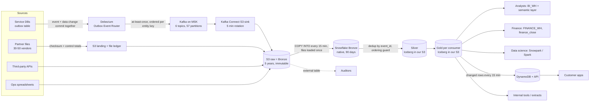

# Lakehouse Data Platform for Lending, Insurance and Recharge — Design Doc

*Draft for the author's review. Code and tests listed in the Appendix are planned, not yet written.*

## 0. Summary

We build one data platform for the three consumer businesses (lending, insurance, recharge). Every business writes its changes as events in the same database transaction as the change itself, so nothing is lost or invented. The events flow through Kafka into an S3 data lake, and Snowflake cleans them into tables that analysts, finance, data scientists, auditors and customer-facing apps each read in the way they need. Raw data is kept 5 years, so any number can be rebuilt and traced. The two hardest problems get code and tests: keeping each loan, policy and order in its correct latest state, and proving that every paisa in our books matches what our partners say. A table is only published as final when we can show the data for that day is complete.

## 1. Context & assumptions

**From the brief:** lending, insurance and recharge on one platform; transactional databases behind each service, event streams, daily partner/vendor files, third-party APIs and a few hand-kept Ops spreadsheets; ~10k events/s at peak; ~500M file rows/day; 50M customers; 5 years of history; money in integer paise; a lakehouse architecture; consumers are analysts, finance, applications, data scientists, auditors. **Everything below marked A is our assumption**, because the brief gives no schemas, event types, file formats or latency targets.

| # | Assumption | If wrong |
|---|---|---|
| A1 | The 10k events/s is the peak of the busiest days (salary days, month start, EMI dates, festivals). Average is 2,000 events/s (peak ≈ 5× average), so ≈ 173M events/day. | If the average is nearer 10k/s (864M/day), storage and Snowflake credits go up ≈ 5×; the MERGE and Silver-storage choices (§11) are revisited first. |
| A2 | Events are business events from services (status changes, money movements), about 0.5–1 KB each. Clickstream and app events are out of scope. | If clickstream is in scope, it gets its own topics and a cheaper path; it must not share the money path. |
| A3 | Each service has its own database (mixed Postgres and MySQL, different schemas), and there are no cross-database transactions. | If a shared database exists, the outbox moves to one place; ordering across services is still not guaranteed. |
| A4 | Services can add an outbox table and write to it in their transaction. Legacy services that cannot yet are covered by a temporary fallback (direct table CDC). | If most teams refuse, the fallback becomes the main route and the raw-schema coupling cost (§5, §11) becomes permanent. |
| A5 | Partner files hold the counterparty's view of our transactions: ~500M rows ≈ 150 GB CSV/day from ~30–50 vendors, one vendor per business unit per file, about 3 lines per transaction (transaction, fee/tax, settlement). 3 × 173M ≈ 500M. New rows only, due by 02:00 IST. | If files are full re-sends, the load window and Large-warehouse cost grow and dedup moves into the file path. If they arrive after 02:00, the daily gate (§6) moves later and the 09:00 finance SLA tightens. |
| A6 | Partners carry our `payment_ref` (we pass it when a transaction starts) plus their own reference. | If not, matching needs the weaker secondary rule for most rows, and the break count rises (§9). |
| A7 | One shared customer ID across units, issued by a central customer service. | If each unit has its own ID, `customers` and the cross-business app profile need an identity-resolution step we have not designed. |
| A8 | Consumer SLAs (the brief gives none): apps ≤ 1 h; analysts intraday ≤ 1 h and yesterday by 07:00 IST; data scientists by 06:00; finance complete and reconciled by 09:00; auditors: any number reproducible. | Tighter app freshness (seconds) needs a streaming path to the app store. Tighter analyst freshness shortens the 15-minute cycle and raises credits. |
| A9 | Apps read their own live data from their own service database. They read the platform only for cross-business, partner, derived or long-history data. | If apps want live data from the platform, freshness drops to seconds and we add a streaming path. |
| A10 | Data scientists need training and batch-scoring features. Online (real-time) prediction is out of scope. | Online prediction adds an online feature store and a sub-second path. |
| A11 | AWS Mumbai (`ap-south-1`) because payment data must be stored in India (RBI, 2018). | A second region is a different, larger design (non-goal below). |
| A12 | Snowflake Enterprise edition and about $3 per credit. | Credit price or edition changes scale every Snowflake figure in §3 linearly. |

## 2. Requirements, SLAs and non-goals

**Must do**
1. Land all sources in a lake and make Silver and Gold tables on a lakehouse (open table format in our own S3).
2. Keep 5 years of history (raw 5 years; finance and audit tables 5 years; other Silver and Gold 2–5 years by business unit).
3. Make each table's correctness and currency checkable: any reader can see whether data is complete and how fresh it is.
4. Serve each consumer within the SLAs in A8.
5. Reproduce any reported number later.

**Must not do:** put the platform on a transaction's critical path; change a closed month silently; match money on "close" amounts.

**Non-goals:** real-time fraud or online ML; deep customer-identity resolution (A7); multi-region disaster recovery (A11); clickstream; a full data-privacy design (erasure requests versus 5-year history are noted, not designed: tokenisation plus crypto-shredding is the likely route).

## 3. Napkin math

| Item | Calculation | Result |
|---|---|---|
| Events per day | 2,000 events/s × 86,400 s/day | ≈ 173M events/day (ceiling 864M/day if peak all day) |
| Peak ingest | 10,000 events/s × ~1 KB | ≈ 10 MB/s (≈ 30 MB/s with RF 3) |
| Records per day | 173M events + 500M file rows | ≈ 673M records/day |
| Events, compressed | 173M × ~1 KB ÷ ~5 (Parquet) | ≈ 35 GB/day |
| Files, compressed | 500M rows × ~300 B ÷ 5 | ≈ 30 GB/day (150 GB CSV before compression) |
| Total raw, compressed | 35 + 30 | ≈ 65 GB/day |
| S3 raw, 5 years | 65 GB/day × 1,825 days | ≈ 119 TB → ≈ $750–850/month at year 5 (tiered Standard, IA, Glacier IR) |
| Kafka, 7 days | 2 MB/s × 86,400 s × 7 days × 3 replicas | ≈ 3.6 TB on brokers |
| Snowflake Bronze, 90 days | 65 GB/day × 90 | ≈ 5.9 TB → ≈ $150–235/month |
| Silver history | 5 years, if every unit keeps 5 | ≈ 100+ TB → ≈ $2.3–4k/month: the largest storage line |
| COPY load | 96 runs/day × ~1.5 min on Small (2 credits/h) | ≈ 4.8 credits/day ≈ $430/month |
| Partner-file load | Large warehouse nightly, ~20–40 min, 4–8 credits/day | ≈ $360–720/month |
| Snowflake total | ≈ 52 credits/day × $3 × 30 | ≈ $4.7k/month, of which BI ≈ 60% |
| DynamoDB | reads ≈ $160–650 + writes ≈ $560 + storage ≈ $31 | ≈ $0.75–1.25k/month |

**These are napkin estimates.** Unit prices (Snowflake credits, S3, DynamoDB, all in Mumbai) and the load times are to be verified; the load-time figures need one test load. MSK, MWAA and Kafka Connect compute are not yet priced (§13).

## 4. Architecture

Airflow (MWAA) runs the steps from COPY onwards. Lineage goes to OpenMetadata from the dbt manifest.

**Decision table** (each row: chose, rejected, why, cost; where it breaks first is in §11).

| Component | Chose | Rejected | Why | What it costs us |
|---|---|---|---|---|
| Event capture | Transactional outbox + Debezium (log-based CDC) | Polling `updated_at`; triggers; services writing to Kafka directly | Event and data change commit together; no load on business tables; no Kafka call in the user's request | Every service team changes its code (organisational rollout); one connector per database |
| Fallback capture | Direct table CDC, only for legacy services, raw layer only | Blocking ingestion until all teams adopt the outbox | Data flows from day one | Exposes internal schemas; breaks when tables change; one route per fact (money always via outbox) |
| Transport | Kafka on MSK, 3 brokers, RF 3, 7-day retention, Avro + schema registry | Kinesis, Pulsar, Confluent Cloud | Debezium writes to it natively; AWS-managed; known stack; 7 days survives a long weekend of downstream outage | Always-on cluster; cross-AZ traffic; ≈ 3.6 TB broker storage |
| Topics | One per business entity per unit, key = entity ID (6 topics, 57 partitions) | One per event type; one for everything | Per-entity order where it matters; clear ownership | ~15–20 support topics to operate |
| Raw landing | Kafka Connect S3 sink, Parquet, 5-min wall-clock rotation, folders by arrival hour | A Spark streaming job writing Delta; Kinesis Firehose | Cheapest write-once raw copy; any tool can read it; offset-named files make retries overwrite | Duplicates possible after retries (removed in Silver); small files (≈ 2 MB at 5 min) |
| Load | `COPY INTO` every 15 min, Small warehouse, scanning today + yesterday | Snowpipe (per-file fees ≈ $90/month at 16,416 files/day plus always-on serverless compute, verify; the freshness gain is lost because dbt runs every 15 min anyway) | COPY skips already-loaded files, so wide windows are safe; simple; batches line up with the dbt cycle | Up to 15 min of wait added to freshness |
| Bronze | S3 raw 5 years + Snowflake native Bronze 90 days | 7-day staging only; "latest batch only" staging; 5 years of Bronze in Snowflake (≈ 64 TB, ≈ $1.6–2.6k/month extra) | S3 alone guarantees the 5 years; 90 days covers most rebuilds with plain SQL. "Latest batch only" loses rows silently if dbt fails after COPY | Daily delete job; rebuilds older than 90 days use a backfill runbook |
| Processing | dbt on Snowflake, orchestrated by Airflow (MWAA) | Spark and Delta on Databricks (Auto Loader, Structured Streaming, Unity Catalog); a two-tier design with the lake building Silver and Snowflake reading it; Streams + Tasks (no tests or docs, stale-stream risk); Dynamic Tables (risk of full recompute over years of history) | One place to clean (Snowflake), one lineage, tests and docs in dbt, team skills | We own the incremental logic and an Airflow deployment |
| Lakehouse tables | Silver and Gold as Snowflake-managed Iceberg tables in our S3; Bronze native | All-native tables; Bronze as Iceberg; Iceberg catalogued outside Snowflake (Glue/Polaris) | Open format for long-lived data, no lock-in, meets the "lakehouse" requirement | External-volume and IAM setup; feature gaps versus native tables (e.g. no Fail-safe, verify), so recovery means rebuilding from S3; no S3 lifecycle tiering on these files |
| Apps store | DynamoDB + API | Snowflake directly (24×7 warehouse ≈ $2.2k/month, 100 ms–s latency); Redis/MemoryDB (≈ 14 nodes, $4–5k/month); Aerospike | 125 GB, single-key reads, single-digit ms; serverless; cheapest at this size | Second store to keep in sync; writes cost ≈ $560/month |
| Orchestration | One Airflow DAG every 15 min, dbt per business unit | One combined step; Snowflake Tasks | Per-unit isolation and retries | An MWAA environment to run |

## 5. Getting data in

| Source | Route | When it misbehaves |
|---|---|---|
| Service DBs | Outbox row written in the business transaction → Debezium reads the transaction log → Kafka → S3 sink → COPY | Debezium or Kafka down: the log and Kafka (7 days) hold the events; consumers catch up. A bad event or schema change affects only its unit's topic and connector. Heartbeats show a dead connector |
| Legacy services | Debezium direct table CDC, raw only, LSN as the sequence | A table change breaks the mapping: that unit's fallback model fails, other units continue. Never used for money that the outbox covers |
| Partner files | SFTP (AWS Transfer Family) or S3 upload → `landing/unit=…/vendor=…/business_date=D/` (versioning on) → ledger row with checksum → load only when the control file is present and the size is stable → nightly COPY on a Large warehouse → per-vendor Bronze (text columns) → mapping config → `silver.partner_records` | Same checksum: skipped. Same name, new checksum: a correction, which replaces the whole partner-day and triggers restatement if already published. `loaded + rejected ≠ trailer rows` or paise total ≠ trailer total: file held. More than 1% rows rejected: whole file quarantined and the partner manager alerted. Missing file against the arrival calendar: page at 04:30 (§6) |
| Third-party APIs | Scheduled Airflow pull within rate limits → raw responses in S3 → COPY → dbt | Rate-limited or failed pull: retried; gaps show in freshness alerts |
| Ops spreadsheets | Full-snapshot export → strict checks → reference tables (`dim_partner`, fee rules) | Check fails: keep the last good version and alert the owner |

**Completeness of loading (D21).** Each COPY scans today and yesterday. Every COPY result is checked and errored files go to quarantine. A file ledger compares the S3 listing with Snowflake load history, and any file unloaded after 30 min raises an alert and is loaded. A per-partition Kafka offset-continuity check proves nothing was lost between Kafka and Snowflake (whether producer transactions leave offset gaps: verify).

## 6. Making it trustworthy

**Correct** is deep dive 1 (record state, §8) and deep dive 2 (money, §9).

**Current (hard problem A, design only, no code).** Two tiers:

- **Intraday tier** (apps, analysts' intraday): freshness, non-blocking. We publish what has arrived, and every table carries `data_as_of`. Worst case ≈ 33 min: sink 5 + COPY wait 15 + load 2 + Silver 3 + app Gold 3 + push 5.
- **Daily tier** (data scientists 06:00, analysts 07:00, finance 09:00): a blocking gate. An arrival hour is complete when Kafka offsets are in Silver with no gaps, counts match across Kafka, S3, Bronze and Silver, and Debezium heartbeats prove the connectors were alive. Partner files count when all expected files are loaded and match their control totals. Business day D is complete when arrival hours through D+1 01:00 IST are complete (1 h allowed lateness, to be tuned to the p99.9 of arrival minus event time) and D's partner files are loaded. The result is recorded in `ops.completeness`; the typical gate time is ≈ 02:30, then daily Gold 02:30–03:30 and reconciliation 03:30–04:30.

*Guarantee:* a business day appears in finance Gold only when every unit's events and every expected partner file for that day are loaded with no offset gaps and matching counts at every hop; if late data changes a published, non-closed day, the day is restated and the change is logged.

*Escalation:* page at 04:30 if the gate is closed; at 06:00 (data scientists) and 07:00 (analysts) the day is marked provisional with the missing source named; finance never receives an incomplete day as final. Late data in an open month restates day D in the next run and writes `ops.restatements`. Late data in a closed month leaves `finance_close` unchanged and is booked as a prior-period adjustment in the current month.

*Decision sentence:* we chose a completeness gate with allowed lateness over a fixed-time cutoff and over freshness-only checks, because a fixed cutoff publishes incomplete days silently and "recent" does not mean "whole"; it costs a late publish when a source is late (finance sees "unreconciled, partner X pending" rather than a wrong figure); it breaks first when one chronically late partner blocks the gate every night. Source-emitted "hour closed" markers are the stronger future upgrade but need every service changed.

**Means what they think it means (D25).** Metrics are defined once in dbt and exposed as Snowflake semantic views. Cortex Analyst answers plain-English questions on the same definitions, and BI dashboards use them too. Open Semantic Interchange (OSI) is the portability path (maturity and current Snowflake status: verify). Guardrails: only certified Gold tables and approved metrics, never Silver or raw; every answer shows its SQL and metric; official finance figures come only from `gold_finance` reports and `finance_close`; a regression set of ~30–50 known questions with expected answers runs in CI; all questions, SQL and users are logged; the same roles, masking and row policies apply; Cortex cost is monitored. It costs wrong-answer risk on money, which the guardrails limit but do not remove.

## 7. Serving it

| Consumer | Reads | Compute | Freshness |
|---|---|---|---|
| Analysts | `gold_<unit>`, `gold_shared`, semantic views | `BI_WH` (Medium, multi-cluster 1–3) | Intraday ≤ 1 h; yesterday by 07:00 IST |
| Finance | `gold_finance` (`fct_money_movements_daily`, `fct_reconciliation_daily`, `fct_reconciliation_breaks`, `snap_loan_book_daily`), `finance_close` | `FINANCE_WH` (Small) | Yesterday complete and reconciled by 09:00; month close on working day 2 |
| Data scientists | `gold_features.feat_customer_history` (values stored only when they change; point-in-time joins), Silver | Snowpark, or Spark reading the Iceberg tables (access path: verify) | Yesterday by 06:00 |
| Customer apps | `gold_app.app_customer_profile` pushed to DynamoDB every 15 min; API on top. Use cases: recommendations and offers, spending insights, account summary across units | DynamoDB | ≤ 1 h; worst ≈ 33 min |
| Internal tools | Snowflake directly through a small dedicated warehouse, read-only role | Small | Per run |
| Batch consumers | Scheduled extracts | — | Per extract |
| Auditors | Read-only role on Silver, `finance_close`, `ops.*`; S3 raw via external table; OpenMetadata lineage | — | On request |

The app profile is one row per customer (≈ 2–3 KB × 50M ≈ 100–150 GB), with IDs, amounts and statuses only: no PAN, Aadhaar, name or full phone. `finance_close` is an append-only table written once per month (not a clone, because Iceberg clone support needs checking: verify). Access uses roles per consumer group, masking policies on personal data and row-access policies per unit.

*Decision sentence:* we chose DynamoDB over serving apps from Snowflake because it gives single-digit ms single-key reads at ≈ $0.75–1.25k/month against a 24×7 warehouse at ≈ $2.2k/month; it costs a second store and an API to keep in sync; it breaks first on write cost if profile churn grows well beyond ~10M updates/day (mitigation: write only changed profiles).

**What happens when it fails:** if the 15-minute push fails, apps keep the last profile with an old `data_as_of`; if Snowflake is down, apps are unaffected, only internal tools and analysts wait.

## 8. Deep dive 1 — B: correct latest state

**Problem.** Events arrive twice, late or out of order, sometimes by two routes, and the current state of every loan, policy and order must still be exactly right.

**Why it is hard.** The obvious fix is "order by timestamp and take the latest". It fails: wall-clock times lie (clock skew, equal timestamps, long transactions). A database auto-sequence also fails, because a value can be assigned before commit and become visible out of order. And a plain `MERGE` that always applies the incoming row lets a late, older event overwrite newer state.

**Options considered.**
1. Order by `occurred_at`: rejected, for the reasons above.
2. Order by an auto-increment ID: rejected, not commit-ordered.
3. Kafka transactions for exactly-once: ends at the first non-transactional boundary (S3 sink, COPY); the lake write must be idempotent anyway.
4. At-least-once delivery plus a source-assigned sequence plus dedup plus a conditional upsert (chosen).

**Decision.** The outbox row is written in the same transaction as the business change. Its `sequence` is the entity's own version number, incremented in that transaction under a row lock on the entity, so sequence order equals commit order. Kafka key = entity ID gives per-entity order on the wire. In dbt Silver: dedup on `event_id` (against the last 8 days, via `incremental_predicates`), then the ordering guard: keep an incoming event only if its sequence is higher than the stored one. Each outbox payload carries the entity's **full state after the change**, so current state is simply the payload of the highest version; a `COALESCE` on fields remains only as a safety net for events that carry partial state. Full event history is kept, so current state can always be rebuilt. Money comes only through the outbox; fallback CDC uses LSN as its sequence and never covers outbox facts.

*Decision sentence:* we chose an entity version number plus a conditional upsert over timestamp ordering and Kafka transactions because it is the one ordering the source can prove; it costs a lock-and-increment in each service's transaction and an extra join in every incremental Silver run; it breaks first when a service does not adopt the version rule (then its order is only as good as its CDC log position) or when a duplicate arrives more than 8 days late.

**Guarantee.** For any loan, policy or order, current state equals the event with the highest source sequence among all events received, regardless of how many times or in what order they arrived.

**Residual risk.** A duplicate arriving more than 8 days late is not removed in Silver. The daily money reconciliation (§9) catches it.

**Where it lives.** `code/outbox/outbox_write_example.sql` (version bump and outbox insert in one transaction); `code/dbt/models/silver/lending/stg_lending_events.sql`, `silver_lending_loan_events.sql` (history, dedup), `silver_lending_loans_current.sql` (ordering guard). The lending unit is the worked example; insurance and recharge follow the same pattern.

**Tests.**
- `tests/test_ordering_guard.py` (T-B-permutation, real code): for a generated event set per entity, every arrival order, with duplicates, produces the same final state.
- Replaying the same batch twice changes nothing.
- Duplicates inside one batch apply once.
- A late, older event does not regress state.
- dbt tests: `unique` and `not_null` on `event_id`, unique entity ID in `current`, sequence never decreases.

## 9. Deep dive 2 — C: exact paise reconciliation

**Problem.** Our internal record of money (EMIs, premiums, recharges, refunds) must match exactly what partners say happened, and every difference must be explained.

**Why it is hard.** The obvious fix is `SUM(internal) = SUM(partner)` per day. It fails: errors cancel (a missing 500 paise and a duplicate 500 paise net to zero); cut-offs and T+1 settlement put the same item on different days; fee and tax lines have no internal twin; and a partner can say FAILED where we say SUCCESS with identical amounts. A tolerance on amounts hides real losses.

**Options considered.** (1) Totals only: rejected, errors cancel. (2) Fuzzy amount matching: rejected, a "close" match cannot be explained to an auditor. (3) Item-level deterministic match, then a bounded secondary rule, every leftover classified (chosen).

**Decision.**
- Internal side: `silver.money_movements`, every paisa from all units in one shape (integer paise, `payment_ref`, event time).
- Partner side: `silver.partner_records`, same shape, from conformed vendor files with control totals checked at load.
- Matching: first exact on `payment_ref` plus vendor; second, same customer and same amount within a ±1–2 day window. Never match on near amounts; zero amount tolerance, tolerance only on time.
- Break classes: missing internally, missing at partner, amount differs, duplicate, timing (resolves next day), status disagreement. Fee and tax lines are checked against the Ops fee-rules reference.
- Output per unit, vendor and day: `fct_reconciliation_daily` (RECONCILED or BREAKS_OPEN, difference in paise) and `fct_reconciliation_breaks` (one row per unmatched item, reason, owner, age). Partner data never updates Silver current state; if the partner is right, the service emits a correcting event.
- Finance reports only reconciled periods or shows open breaks explicitly; month close happens after breaks are resolved or formally accepted.

*Decision sentence:* we chose item-level matching with classified breaks and zero amount tolerance over total-vs-total comparison because only itemised matches can be explained to auditors; it costs a daily item-level join of the day's internal money movements (a subset of ~173M events) against ~500M partner lines, finishing ≈ 04:30 with ≈ 4.5 h of slack before 09:00; it breaks first if partners do not carry our `payment_ref` (A6), when the secondary rule must do most of the work.

**Guarantee.** For every partner and business day, every internal money movement and every partner record is either matched exactly in paise or listed as a classified break with an owner; matched + breaks equals the total on both sides, so no paisa is unaccounted for.

**Where it lives.** `code/dbt/models/silver/shared/silver_money_movements.sql`, `silver_partner_records.sql`; `code/dbt/models/gold/finance/fct_reconciliation_daily.sql`, `fct_reconciliation_breaks.sql`.

**Tests.**
- `tests/dbt/assert_reconciliation_balances.sql` (T-C-matched+breaks=total, real code): per vendor and day, on both sides, matched paise + break paise = total paise exactly, and the same for counts. It returns rows only when the identity fails.
- Seeded cases, one per break class, each must land in its class.
- A cancelling pair (missing 500 paise, duplicate 500 paise) must produce two breaks, not zero.

## 10. Living with it

- **Running.** One Airflow DAG every 15 min: copy → dbt silver per unit → shared silver → app profile and push → intraday analytics, ≈ 6–10 min of the 15. `max_active_runs=1`, `catchup=False`, two retries with a 2-minute delay. Daily Gold starts when the completeness gate opens. The month-close append runs on working day 2.
- **Failure and recovery.** Each dbt model is written by one atomic statement, so no table is ever half-written. A failed run leaves earlier models updated and later ones untouched; the next run re-reads by `_loaded_at` with a 30-minute overlap, and because every write is idempotent (dedup + ordering guard), re-reading is harmless. Rebuild within 90 days: `dbt build --full-refresh` or a targeted rebuild from Bronze. Older: a backfill runbook (`COPY … FORCE = TRUE` from the needed S3 folders into a backfill table, then dbt). Because Silver and Gold are Iceberg tables without Fail-safe (verify), the recovery path is always "rebuild from S3 raw".
- **Monitoring in four layers.** (1) Task error notifications; (2) alerts on task and COPY history; (3) data-freshness alerts (`dbt source freshness` on Bronze `_loaded_at`); (4) a dashboard of lag, counts and `ops.completeness`. Pages: gate closed at 04:30, COPY errors, connector heartbeat missing.
- **Retention.** Kafka 7 days; S3 raw 5 years; Snowflake Bronze 90 days; quarantine 1 year; Silver and Gold 2–5 years per business unit, set in dbt (`meta: retention_years`) and enforced by a daily delete job by event date. Floors of 5 years apply to finance Gold, `finance_close`, `silver.money_movements` and Ops run records. The brief's five years is guaranteed by immutable raw data plus these floors.
- **Audit trail.** `ops.run_manifest` records the Airflow run ID, dbt run ID, git SHA and input range per run, so a reported number can be traced to data and code versions.
- **Cost (napkin; unit prices to verify).** Snowflake ≈ $4.7k/month at $3/credit, BI ≈ 60%; partner-file load ≈ $360–720/month; DynamoDB ≈ $0.75–1.25k/month; S3 ≈ $750–850/month at year 5; Snowflake Bronze ≈ $150–235/month; Silver storage ≈ $2.3–4k/month at 5 years (the largest storage line; lever: drop the raw JSON payload after 90 days, about half the size). The biggest lever is BI hours and concurrency (auto-suspend 60 s, result caching, scheduled dashboard refresh).

## 11. Where it breaks first

| Type | What breaks | Sign | Mitigation |
|---|---|---|---|
| Growth | MERGE and target-scan cost on multi-year Silver as history grows | 15-minute dbt runs creeping past 10 min | `incremental_predicates` (8 days), clustering by load date; retention by unit |
| Growth | DynamoDB write cost if profile churn rises | Write cost above ≈ $560/month | Write only changed profiles; offers as a small separate item (≈ 0.5 KB) |
| Growth | Partner-file window if volume or lateness grows | Load finishing after 03:00 | Larger warehouse (same credits, faster), split files ~100–250 MB gzipped |
| Growth | Small files at the S3 sink (≈ 2 MB at 5 min) | COPY time up | Fewer partitions on low-volume topics, longer rotation off the app path |
| Operational | Late partner file | Gate still closed at 04:30 (page) | Day published provisional with partner named; restate later |
| Operational | Stale data from a silent stall | Freshness alert | `data_as_of` on every table; app profile shows its age |
| Operational | Duplicate more than 8 days late | Reconciliation break | Detected in C, fixed as a restatement |
| Organisational | Outbox adoption across service teams | Number of services still on fallback CDC | Fallback keeps data flowing; adoption tracked by service; contracts via schema registry |
| Organisational | Vendor format changes | Header check or control-total failure | Per-vendor mapping config; file held and partner manager alerted |

## 12. Test plan

The full plan is in [test-plan.md](test-plan.md): 13 tests, each stating what it asserts and how it would fail if the design were wrong. Two are written as real code: **T-B-permutation** (every arrival order and duplicate pattern gives the same current state) and **T-C-matched+breaks=total** (no paisa lost or double-counted by reconciliation). The rest cover replay, late events, dedup, sequence monotonicity, break classification, completeness counts, the daily gate, control totals, restatement and failure injection.

## 13. Honesty

**(a) Left out on purpose.**
- Customer identity resolution across units (A7): hard and separate; we assume a central ID.
- Multi-region disaster recovery: the brief gives a single region and the complexity is not earned yet.
- Real-time fraud and online ML features: nothing in the brief needs them.
- Deletion-request design: noted (tokenisation, crypto-shredding), not designed.
- Regulated KYC retention that may exceed 5 years after a relationship ends.
- Clickstream and app events.
- Code for completeness (A) and for the other pipelines: design only.

**(b) Where I am unsure (verify).**
- Snowflake Iceberg feature limits: clone support, Fail-safe, Time Travel, MERGE performance, access from Spark.
- The dbt Iceberg configuration (`table_format='iceberg'`, external volume) for the dbt-snowflake version used.
- OSI maturity and the current status of Snowflake semantic views and Cortex Analyst.
- Prices in Mumbai: Snowflake credit and storage, S3 tiers, DynamoDB (including the on-demand price change), Snowpipe.
- Load-time estimates (COPY ≈ 1–2 min average, ≈ 3–5 min at peak; partner load ≈ 20–40 min): need one test load.
- Debezium Outbox Event Router config keys and whether producer transactions leave Kafka offset gaps.
- MSK, MWAA and Kafka Connect costs: not yet priced.
- The ~3-lines-per-transaction partner ratio and the 8-day dedup window: assumptions, not measurements.

**(c) AI use.**

> ✍️ AUTHOR TO WRITE IN OWN WORDS:
> - What I asked AI for (study notes, event-rate math, source and option comparisons, drafts of this document).
> - What I kept, changed or rejected (for example, which suggestions I turned down and why).
> - How I verified it (what I checked against documentation, what I computed myself, what remains unchecked).

## Appendix: code & tests index

*Planned; none of this code is written yet.*

| Path | Proves | Deep dive |
|---|---|---|
| `code/outbox/outbox_write_example.sql` | Version bump and outbox insert in one transaction | B |
| `code/dbt/models/silver/lending/stg_lending_events.sql` | Raw rename and cast | B |
| `code/dbt/models/silver/lending/silver_lending_loan_events.sql` | History with dedup on `event_id` | B |
| `code/dbt/models/silver/lending/silver_lending_loans_current.sql` | Ordering guard | B |
| `code/dbt/models/silver/shared/silver_money_movements.sql` | Internal money in one shape | C |
| `code/dbt/models/silver/shared/silver_partner_records.sql` | Partner side in the same shape | C |
| `code/dbt/models/gold/finance/fct_reconciliation_daily.sql` | Matching and daily status | C |
| `code/dbt/models/gold/finance/fct_reconciliation_breaks.sql` | Classified breaks | C |
| `tests/dbt/assert_reconciliation_balances.sql` | matched + breaks = total, exact paise | C |
| `tests/test_ordering_guard.py` | Permutation and replay | B |
