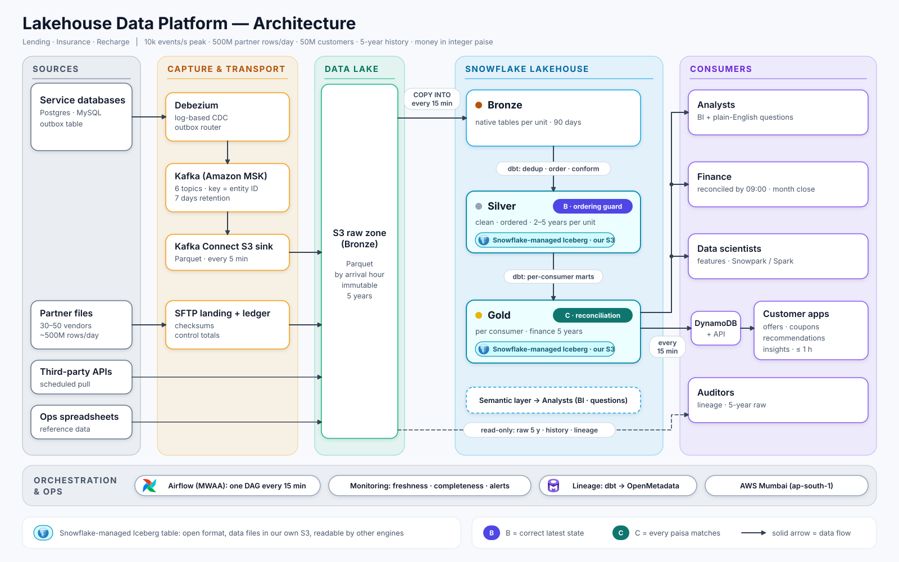

# Lakehouse Data Platform for Lending, Insurance and Recharge — Design Doc

*Draft for the author's review. Code and tests listed in the Appendix are planned, not yet written.*

## 0. Summary

We build one data platform for lending, insurance and recharge. Each business writes its changes as events in the same database transaction as the change itself, so nothing is lost or invented. Events flow through Kafka into an S3 data lake. Snowflake cleans them into tables for analysts, finance, data scientists, auditors and customer apps. Raw data is kept 5 years, so any number can be rebuilt and traced. The two hardest problems get code and tests: keeping each loan, policy and order in its correct latest state, and proving that every paisa in our books matches what our partners say. A table is published as final only when the day's data is shown to be complete.

## 1. Context & assumptions

**From the brief:** service databases, event streams, daily partner files, third-party APIs, Ops spreadsheets; ~10k events/s at peak; ~500M file rows/day; 50M customers; 5 years of history; money in integer paise; a lakehouse; consumers are analysts, finance, apps, data scientists, auditors. **Items marked A are our assumptions**: the brief gives no schemas, event types, file formats or latency targets.

| # | Assumption | If wrong |
|---|---|---|
| A1 | 10k events/s is the busiest-day peak (salary days, month start, EMI dates, festivals). Average is 2,000 events/s (peak ≈ 5× average), so ≈ 173M events/day. | At 10k/s average (864M/day), storage and credits rise ≈ 5×. |
| A2 | Events are business events (status changes, money movements), ~0.5–1 KB each. No clickstream. | Clickstream gets its own path, not the money path. |
| A3 | Each service has its own database (Postgres and MySQL); no cross-database transactions. | Cross-service order is still not guaranteed. |
| A4 | Services can add an outbox table. Legacy services use a temporary fallback (direct table CDC, change data capture). | If most teams refuse, the fallback becomes the main route (§11). |
| A5 | Partner files show the counterparty's view of our transactions: ~500M rows ≈ 150 GB CSV/day from ~30–50 vendors, ~3 lines per transaction (3 × 173M ≈ 500M). New rows only, due by 02:00 IST. | Full re-sends raise load cost. Later files push the gate (§6) later. |
| A6 | Partners carry our `payment_ref` plus their own reference. | Most rows need the weaker secondary rule (§9). |
| A7 | One customer ID across units, from a central customer service. | Needs identity resolution (not designed). |
| A8 | SLAs (the brief gives none): apps ≤ 1 h; analysts intraday ≤ 1 h and yesterday by 07:00 IST; data scientists by 06:00; finance complete and reconciled by 09:00; auditors: any number reproducible. | Seconds-level apps need streaming; tighter analyst freshness raises credits. |
| A9 | Apps read live data from their own service database; the platform serves cross-business, partner, derived or long-history data. | Live platform data needs a streaming path. |
| A10 | Data scientists need training and batch-scoring features. No online prediction. | Needs an online feature store. |
| A11 | AWS Mumbai (`ap-south-1`); payment data must stay in India (RBI, 2018). | A second region is a larger design. |
| A12 | Snowflake Enterprise edition, about $3 per credit. | Every Snowflake figure in §3 scales linearly. |
| A13 | The brief's "event streams" are the services' business events, published through the outbox. Any service that produces to Kafka directly must use the same event envelope (`event_id`, entity ID, `sequence`, `occurred_at`) and the same topics. | Producers without a sequence lose the ordering guarantee in §8; their topics get dedup only. |
| A14 | Business teams decide the Gold grains (hourly, daily, monthly, customer-level), the retention of their Silver and Gold tables, and the definitions of their metrics, through a short data contract. The platform team reviews each request for cost. | Without owners, metrics drift between teams (the brief's "inconsistent between teams"). |

## 2. Requirements, SLAs and non-goals

**Must do:** land all sources in a lake and build Silver and Gold in an open table format in our own S3; keep 5 years of history (raw, finance, money and audit tables 5 years; other Silver and Gold kept per business-team requirement, 2–5 years by table and grain); show how complete and fresh each table is; meet the SLAs in A8; reproduce any reported number.

**Must not do:** sit on a transaction's critical path; change a closed month silently; match money on "close" amounts.

**Non-goals:** real-time fraud or online ML; customer-identity resolution (A7); multi-region disaster recovery (A11); clickstream; a full privacy design (erasure requests versus 5-year history are noted, not designed; tokenisation plus crypto-shredding is the likely route).

## 3. Napkin math

| Item | Calculation | Result |
|---|---|---|
| Events per day | 2,000 events/s × 86,400 s/day | ≈ 173M events/day (ceiling 864M/day if peak all day) |
| Peak ingest | 10,000 events/s × ~1 KB | ≈ 10 MB/s (≈ 30 MB/s with RF 3) |
| Records per day | 173M events + 500M file rows | ≈ 673M records/day |
| Raw, compressed | events 173M × ~1 KB ÷ ~5 (Parquet) ≈ 35 GB; files 500M rows × ~300 B ÷ 5 ≈ 30 GB (150 GB CSV before compression) | ≈ 65 GB/day |
| S3 raw, 5 years | 65 GB/day × 1,825 days | ≈ 119 TB → ≈ $750–850/month at year 5 (tiered Standard, IA, Glacier IR) |
| Kafka, 7 days | 2 MB/s × 86,400 s × 7 days × 3 replicas | ≈ 3.6 TB on brokers |
| Snowflake Bronze, 90 days | 65 GB/day × 90 | ≈ 5.9 TB → ≈ $150–235/month |
| Silver + Gold history (Iceberg in our S3, billed by AWS) | ~55 GB/day; up to 5 years if every team keeps 5 | ≈ 20 TB in year 1, ≈ 100 TB by year 5 → ≈ $0.5k → ≈ $2.5k/month at ~$25/TB: the largest storage line |
| Loads | COPY: 96 runs/day × ~1.5 min on Small (2 credits/h) ≈ 4.8 credits/day ≈ $430/month. Partner files: Large warehouse nightly, ~20–40 min, 4–8 credits/day | ≈ $360–720/month for partner files |
| Snowflake compute | ≈ 52 credits/day × $3 × 30: load 4.8 + transform 13.6 + finance 2 + BI 32 (Medium, ~8 h/day, 1 cluster on average); partner-file load is a separate line | ≈ $4.7k/month, of which BI ≈ 60% |
| DynamoDB | reads ≈ $160–650 + writes ≈ $560 + storage ≈ $31 | ≈ $0.75–1.25k/month |

**Monthly cost summary** (napkin, list prices; all to verify for Mumbai):

| Line | Basis | ≈ $/month |
|---|---|---|
| Snowflake compute | 52 credits/day (above) | 4,700 |
| Partner-file load | 4–8 credits/day on a Large warehouse | 360–720 |
| Kafka (MSK) | 3 brokers × ~$0.21/h × 730 h + 3.6 TB broker storage × ~$0.10/GB | ~820 |
| Kafka Connect (Debezium + S3 sink) | ~14 capacity units × ~$0.11/h × 730 h | ~1,100 |
| Airflow (MWAA) | small environment, ~$0.49/h × 730 h | ~360 |
| SFTP (AWS Transfer Family) | 1 endpoint, ~$0.30/h + ~35 GB/day uploaded | ~260 |
| Cross-zone traffic | Kafka replication, ~10 TB/month × ~$0.02/GB | ~200 |
| DynamoDB | reads + writes + storage | 750–1,250 |
| Snowflake Bronze | ~5.9 TB | 150–235 |
| S3 raw | tiered; grows to 119 TB | ~370 (year 1) → 750–850 (year 5) |
| S3 Silver + Gold (Iceberg) | grows to ~100 TB | ~500 (year 1) → ~2,500 (year 5) |
| **Total** | | **≈ $9.5–10.5k (year 1) → ≈ $12–13k (year 5)** |

Compute is about half the bill and BI is its largest part; storage grows each year, and the Silver payload drop (§10) is the main storage lever. Load times need one test load.

## 4. Architecture

How the data flows:

1. Each service writes its change and an outbox row in one transaction. Debezium (log-based CDC) publishes it to Kafka on MSK. Partner files, APIs and spreadsheets land in S3.
2. A Kafka Connect sink writes events to S3 as the raw layer (Bronze), kept 5 years, never edited.
3. Every 15 minutes `COPY INTO` loads new S3 files into Snowflake Bronze (native, 90 days).
4. dbt builds Silver (deduplicated, ordered, Iceberg in our S3), then Gold per consumer (Iceberg).
5. Gold feeds analysts, finance and data scientists. Changed rows go to DynamoDB for apps. Auditors read Silver, `finance_close` and raw S3.
6. Airflow runs everything from COPY onwards. OpenMetadata shows lineage from the dbt manifest.

**Decision table** (chose, rejected, why, cost; where each breaks first is in §11).

| Component | Chose | Rejected | Why | Cost |
|---|---|---|---|---|
| Event capture | Transactional outbox + Debezium; direct table CDC only as a raw-layer fallback for legacy services | Polling `updated_at`; triggers; services writing to Kafka; blocking until all teams adopt the outbox | Event and change commit together; fallback gets data flowing from day one | Every service team changes code; fallback exposes internal schemas (money always via outbox) |
| Transport | Kafka on MSK, RF 3, 7-day retention, Avro + schema registry; one topic per entity per unit, key = entity ID (6 topics, 57 partitions) | Kinesis, Pulsar, Confluent Cloud; one topic per event type | Native to Debezium; managed; 7 days covers a long weekend; per-entity order | Always-on cluster; ≈ 3.6 TB broker storage; ~15–20 support topics |
| Raw landing | Kafka Connect S3 sink, Parquet, 5-min rotation | Spark job writing Delta; Firehose | Cheapest write-once copy; retries overwrite | Duplicates (removed in Silver); small files (≈ 2 MB) |
| Load | `COPY INTO` every 15 min, Small warehouse, today + yesterday | Snowpipe (≈ $90/month fees at 16,416 files/day plus serverless compute, verify; no gain, as dbt runs every 15 min) | COPY skips loaded files, so wide windows are safe | Up to 15 min added to freshness |
| Bronze | S3 raw 5 years + Snowflake 90 days | "Latest batch only" (loses rows if dbt fails after COPY); 5 years in Snowflake (≈ $1.6–2.6k/month extra) | S3 holds 5 years; 90 days covers most rebuilds | Daily delete job; older rebuilds need a runbook |
| Processing | dbt on Snowflake, Airflow (MWAA), one DAG per 15 min, dbt per unit | Spark/Delta on Databricks; Streams + Tasks (no tests or docs); Dynamic Tables (full-recompute risk) | One place to clean, one lineage, team skills | We own incremental logic and Airflow |
| Lakehouse tables | Silver and Gold as Snowflake-managed Iceberg in our S3; Bronze native | All-native; Bronze as Iceberg; external catalog (Glue/Polaris) | Open format, no lock-in | No Fail-safe (verify), so recovery means rebuilding from S3; no S3 lifecycle tiering |
| Apps store | DynamoDB + API | Snowflake (24×7 warehouse ≈ $2.2k/month, 100 ms–s latency); Redis/MemoryDB (≈ $4–5k/month); Aerospike | 125 GB, single-key reads, single-digit ms; cheapest | Second store to sync; writes ≈ $560/month |

## 5. Getting data in

| Source | Route | When it misbehaves |
|---|---|---|
| Service DBs | Outbox row in the business transaction → Debezium reads the log → Kafka → S3 sink → COPY | Debezium or Kafka down: the log and Kafka (7 days) hold the events. A bad event hits only its unit's topic. Heartbeats expose a dead connector |
| Legacy services | Debezium table CDC, raw only, LSN as the sequence | A table change breaks only that fallback model |
| Partner files | SFTP or S3 upload → `landing/unit=…/vendor=…/business_date=D/` (versioning on) → ledger row with checksum → load once the control file is present and size is stable → nightly COPY on a Large warehouse → per-vendor Bronze → mapping config → `silver.partner_records` | Same checksum: skipped. Same name, new checksum: a correction that replaces the partner-day (restatement if published). `loaded + rejected ≠ trailer rows` or paise total ≠ trailer total: file held. Over 1% rows rejected: quarantined, partner manager alerted. Missing file: page at 04:30 (§6) |
| APIs and spreadsheets | Airflow pull within rate limits, or full-snapshot spreadsheet export with strict checks → S3 → COPY → dbt (spreadsheets feed reference tables such as `dim_partner`) | Failed pull is retried; gaps show in freshness alerts. A failed spreadsheet check keeps the last good version and alerts the owner |

**Schema changes.** Producers register Avro schemas in the schema registry with backward compatibility enforced, so a breaking change is rejected before it reaches Kafka. New optional fields flow through untouched in the raw payload and are mapped into Silver when a team needs them. Vendor format changes are caught by the per-vendor header check and handled by updating that vendor's mapping config.

**Completeness of loading (D21).** Every COPY result is checked; errored files go to quarantine. A file ledger compares the S3 listing with Snowflake load history; a file unloaded after 30 min raises an alert. A per-partition Kafka offset-continuity check proves nothing was lost between Kafka and Snowflake (whether producer transactions leave offset gaps: verify).

## 6. Making it trustworthy

**Correct:** see §8 (record state) and §9 (money).

**Current (hard problem A, design only, no code).** Two tiers:

- **Intraday** (apps, analysts' intraday): non-blocking. We publish what has arrived, and every table carries `data_as_of`. Worst case ≈ 33 min (sink 5 + COPY wait 15 + load 2 + Silver 3 + app Gold 3 + push 5).
- **Daily** (data scientists 06:00, analysts 07:00, finance 09:00): a blocking gate. An arrival hour is complete when Kafka offsets reach Silver with no gaps, counts match across Kafka, S3, Bronze and Silver, and Debezium heartbeats show the connectors were alive. Business day D is complete when arrival hours through D+1 01:00 IST are complete (1 h allowed lateness, to be tuned to the p99.9 of arrival minus event time) and all expected partner files for D are loaded and match their control totals. The result goes to `ops.completeness`. Gate ≈ 02:30; daily Gold 02:30–03:30; reconciliation 03:30–04:30.

*Guarantee:* a business day appears in finance Gold only when every unit's events and every expected partner file for that day are loaded with no offset gaps and matching counts at every hop; if late data changes a published, non-closed day, the day is restated and the change is logged.

*Escalation:* page at 04:30 if the gate is closed. At 06:00 and 07:00 the day is marked provisional, naming the missing source. Finance never gets an incomplete day as final. Late data in an open month restates day D in the next run (logged in `ops.restatements`). In a closed month, `finance_close` stays unchanged and the change is booked as a prior-period adjustment in the current month.

*Decision sentence:* we chose a completeness gate with allowed lateness over a fixed-time cutoff and over freshness-only checks, because a fixed cutoff publishes incomplete days silently and "recent" does not mean "whole"; it costs a late publish when a source is late (finance sees "unreconciled, partner X pending", not a wrong figure); it breaks first when one chronically late partner blocks the gate every night. Source-emitted "hour closed" markers are a stronger upgrade but need every service changed.

**Means what they think it means (D25).** Metrics are defined once in dbt and exposed as Snowflake semantic views, used by BI dashboards and by Cortex Analyst (plain-English questions). Open Semantic Interchange (OSI) is the portability path (maturity and Snowflake status: verify). It costs wrong-answer risk on money; the guardrails limit it but do not remove it:

- Only certified Gold tables and approved metrics; every answer shows its SQL; all questions are logged.
- Official finance figures come only from `gold_finance` and `finance_close`.
- ~30–50 known questions run as a regression set in CI; roles, masking and row policies apply; Cortex cost is monitored.
- **Owned by business teams (A14):** each metric and its allowed grains (hour, day, month, customer) belong to the team that defines it (e.g. finance owns "disbursed amount", lending owns "EMI collection rate"). Changes go through review, metrics are versioned and certified, and two teams cannot define the same metric differently.

## 7. Serving it

| Consumer | Reads | Compute | Freshness |
|---|---|---|---|
| Analysts | `gold_<unit>`, `gold_shared`, semantic views | `BI_WH` (Medium, 1–3 clusters) | Intraday ≤ 1 h; yesterday by 07:00 IST |
| Finance | `gold_finance` (daily money movements, reconciliation, breaks, loan-book snapshot), `finance_close` | `FINANCE_WH` (Small) | Yesterday complete and reconciled by 09:00; month close on working day 2 |
| Data scientists | `gold_features.feat_customer_history`, Silver | Snowpark, or Spark on Iceberg (access: verify) | Yesterday by 06:00 |
| Customer apps | `gold_app.app_customer_profile` pushed to DynamoDB every 15 min; API on top. Use cases: **offers, coupons, recommendations**, spending insights, cross-business account summary ("batch compute, online serve") | DynamoDB | ≤ 1 h; worst ≈ 33 min |
| Internal tools, batch consumers | Snowflake read-only role; scheduled extracts | Small dedicated warehouse | Per run |
| Auditors | Read-only Silver, `finance_close`, `ops.*`; raw S3 via external table; lineage | — | On request |

**Core tables** (lending shown; other units follow the same pattern):

| Table | Grain | Key | Ordering / dedup |
|---|---|---|---|
| `silver.lending_loan_events` | one row per event | `event_id` | dedup on `event_id`; ordered by `sequence` |
| `silver.lending_loans_current` | one row per loan | `loan_id` | ordering guard on `sequence` (§8) |
| `silver.money_movements` | one row per money movement, all units | `event_id` | carries `payment_ref`, amount in paise |
| `silver.partner_records` | one row per vendor line | `(vendor, vendor_ref, line_type)` | replaced per partner-day |
| `gold_finance.fct_reconciliation_breaks` | one row per unmatched item | `(vendor, business_date, item_ref)` | reason, owner, age |
| `gold_app.app_customer_profile` | one row per customer | `customer_id` | `data_as_of` |

**Gold grains are set by business teams (A14).** Each Gold table declares its grain, owner, refresh and retention in dbt `meta`, agreed with the owning team:

| Grain | Examples | Typical owner | Refresh | Retention (team's choice, within floors) |
|---|---|---|---|---|
| Hourly | recharge volume and success rate; EMI collections in progress | business units, Ops | every 15 min | e.g. 90 days |
| Daily | money movements, reconciliation, collections, premiums | finance, analysts | after the daily gate | 2–5 years (finance 5) |
| Monthly | finance close, spending insights, trends | finance, analysts | monthly rollup | 5 years |
| Customer-level | app profile, offer and coupon eligibility, segments, features | product, data science | every 15 min / daily | current + history as required |
| Entity-level | loan-book snapshot, policy status | business units | daily | 2–5 years |

The app profile is one row per customer (≈ 2–3 KB × 50M ≈ 100–150 GB): IDs, amounts and statuses only, no PAN, Aadhaar, name or full phone. `finance_close` is an append-only table written monthly (not a clone; Iceberg clone support: verify). Access: roles per consumer group, masking on personal data, row-access policies per unit.

*Decision sentence:* we chose DynamoDB over serving apps from Snowflake because it gives single-digit ms single-key reads at ≈ $0.75–1.25k/month against a 24×7 warehouse at ≈ $2.2k/month; it costs a second store and an API to keep in sync; it breaks first on write cost if profile churn grows well beyond ~10M updates/day.

**When it fails:** a failed push leaves apps on the last profile, with an old `data_as_of`. If Snowflake is down, apps are unaffected.

## 8. Deep dive 1 — B: correct latest state

**Problem.** Events arrive twice, late, out of order, or by two routes, yet the current state of every loan, policy and order must be exactly right.

**Why it is hard.** The obvious fix, "order by timestamp and take the latest", fails: wall-clock times lie (clock skew, equal timestamps, long transactions). An auto-sequence also fails: a value can be assigned before commit and become visible out of order. A plain `MERGE` that always applies the incoming row lets a late, older event overwrite newer state.

**Options considered.**
1. Order by `occurred_at` or an auto-increment ID: rejected, for the reasons above.
2. Kafka transactions for exactly-once: ends at the first non-transactional boundary (S3 sink, COPY); the lake write must be idempotent anyway.
3. At-least-once delivery plus a source-assigned sequence plus dedup plus a conditional upsert (chosen).

**Decision.** The outbox row is written in the same transaction as the business change. Its `sequence` is the entity's own version number, incremented in that transaction under a row lock, so sequence order equals commit order. Kafka key = entity ID keeps per-entity order on the wire. In dbt Silver we dedup on `event_id` (last 8 days, via `incremental_predicates`), then apply the ordering guard: keep an incoming event only if its sequence is higher than the stored one. Each payload carries the entity's **full state after the change**, so current state is the highest version's payload; a field-level `COALESCE` is only a safety net. Money comes only through the outbox; fallback CDC uses LSN as its sequence and never covers outbox facts.

*Decision sentence:* we chose an entity version number plus a conditional upsert over timestamp ordering and Kafka transactions because it is the one ordering the source can prove; it costs a lock-and-increment in each service's transaction and an extra join in every incremental Silver run; it breaks first when a service does not adopt the version rule (then its order is only as good as its CDC log position) or when a duplicate arrives more than 8 days late.

**Guarantee.** For any loan, policy or order, current state equals the event with the highest source sequence among all events received, regardless of how many times or in what order they arrived.

**Residual risk.** A duplicate more than 8 days late is not removed in Silver; the daily reconciliation (§9) catches it.

**Where it lives.** `code/outbox/outbox_write_example.sql` (version bump and outbox insert); `code/dbt/models/silver/lending/` (`stg_lending_events.sql`, `silver_lending_loan_events.sql` for history and dedup, `silver_lending_loans_current.sql` for the ordering guard). Lending is the worked example; other units follow the same pattern.

**Tests.**
- `tests/test_ordering_guard.py` (T-B-permutation, real code): for a generated event set per entity, every arrival order, with duplicates, gives the same final state.
- Replaying a batch twice changes nothing; duplicates in one batch apply once; a late, older event does not regress state.
- dbt tests: `unique` and `not_null` on `event_id`, unique entity ID in `current`, sequence never decreases.

## 9. Deep dive 2 — C: exact paise reconciliation

**Problem.** Our record of money (EMIs, premiums, recharges, refunds) must match what partners say happened, and every difference must be explained.

**Why it is hard.** The obvious fix is `SUM(internal) = SUM(partner)` per day. It fails: errors cancel (a missing 500 paise and a duplicate 500 paise net to zero); cut-offs and T+1 settlement put one item on two days; fee and tax lines have no internal twin; a partner can say FAILED where we say SUCCESS with identical amounts. An amount tolerance hides real losses.

**Options considered.** (1) Totals only: rejected, errors cancel. (2) Fuzzy amount matching: rejected, a "close" match cannot be explained to an auditor. (3) Item-level exact match, then a bounded secondary rule, every leftover classified (chosen).

**Decision.**
- `silver.money_movements` (internal) and `silver.partner_records` (partner, from conformed vendor files with control totals checked at load) share one shape: integer paise, `payment_ref`, event time.
- Matching: first exact on `payment_ref` plus vendor; second, same customer and same amount within a ±1–2 day window. Never match on near amounts: zero amount tolerance, tolerance only on time.
- Break classes: missing internally, missing at partner, amount differs, duplicate, timing (resolves next day), status disagreement. Fee and tax lines are checked against the Ops fee rules.
- Output per unit, vendor and day: `fct_reconciliation_daily` (RECONCILED or BREAKS_OPEN, difference in paise) and `fct_reconciliation_breaks` (one row per unmatched item: reason, owner, age). Partner data never updates Silver state; if the partner is right, the service emits a correcting event.
- Finance reports only reconciled periods or shows open breaks. Month close waits until breaks are resolved or formally accepted.

*Decision sentence:* we chose item-level matching with classified breaks and zero amount tolerance over total-vs-total comparison because only itemised matches can be explained to auditors; it costs a daily item-level join of the day's internal money movements (a subset of ~173M events) against ~500M partner lines, finishing ≈ 04:30 with ≈ 4.5 h of slack before 09:00; it breaks first if partners do not carry our `payment_ref` (A6), when the secondary rule must do most of the work.

**Guarantee.** For every partner and business day, every internal money movement and every partner record is either matched exactly in paise or listed as a classified break with an owner; matched + breaks equals the total on both sides, so no paisa is unaccounted for.

**Where it lives.** `code/dbt/models/silver/shared/silver_money_movements.sql`, `silver_partner_records.sql`; `code/dbt/models/gold/finance/fct_reconciliation_daily.sql`, `fct_reconciliation_breaks.sql`.

**Tests.**
- `tests/dbt/assert_reconciliation_balances.sql` (T-C-matched+breaks=total, real code): per vendor and day, on both sides, matched paise + break paise = total paise, and the same for counts. It returns rows only when the identity fails.
- Seeded cases, one per break class, each must land in its class.
- A cancelling pair (missing 500 paise, duplicate 500 paise) must produce two breaks, not zero.

## 10. Living with it

- **Running.** One Airflow DAG every 15 min: copy → dbt Silver per unit → shared Silver → app profile and push → intraday analytics (≈ 6–10 min of the 15). `max_active_runs=1`, `catchup=False`, two retries 2 minutes apart. Daily Gold starts when the gate opens; month close runs on working day 2.
- **Failure and recovery.** Each dbt model is one atomic statement, so no table is half-written. The next run re-reads by `_loaded_at` with a 30-minute overlap; writes are idempotent (dedup + ordering guard), so this is harmless. Within 90 days, rebuild with `dbt build --full-refresh` or from Bronze. Older: a backfill runbook (`COPY … FORCE = TRUE` from S3 into a backfill table, then dbt). Silver and Gold have no Fail-safe (verify): recovery is always "rebuild from S3 raw".
- **Monitoring.** Task and COPY alerts; `dbt source freshness` on Bronze `_loaded_at`; a dashboard of lag, counts and `ops.completeness`. Pages: gate closed at 04:30, COPY errors, connector heartbeat missing.
- **Retention.** Kafka 7 days; S3 raw 5 years; Bronze 90 days; quarantine 1 year; Silver and Gold per business-team requirement, 2–5 years by table and grain (e.g. hourly aggregates 90 days, monthly 5 years), declared as `meta: retention_years` in dbt and enforced by a daily delete job by event date, with a 5-year floor for finance Gold, `finance_close`, `silver.money_movements` and Ops run records.
- **Audit trail.** `ops.run_manifest` records Airflow run ID, dbt run ID, git SHA and input range per run.
- **Cost levers (figures in §3).** BI is ≈ 60% of Snowflake: use auto-suspend 60 s, result caching and scheduled dashboard refresh. Silver storage is the largest storage line: drop the raw JSON payload after 90 days (about half the size).

## 11. Where it breaks first

| Type | What breaks | Sign | Mitigation |
|---|---|---|---|
| Growth | MERGE and scan cost on multi-year Silver | dbt runs creeping past 10 min | `incremental_predicates` (8 days), clustering by load date, retention by unit |
| Growth | DynamoDB write cost if profile churn rises | Writes above ≈ $560/month | Write only changed profiles; offers as a separate ≈ 0.5 KB item |
| Growth | Partner-file window; small files at the S3 sink (≈ 2 MB at 5 min) | Partner load after 03:00; COPY time up | Larger warehouse (same credits, faster), files split to ~100–250 MB gzipped; fewer partitions on quiet topics |
| Operational | Late partner file | Gate closed at 04:30 (page) | Publish provisional, naming the partner; restate later |
| Operational | Silent stall; duplicate over 8 days late | Freshness alert; reconciliation break | `data_as_of` on every table; late duplicate caught in §9 and restated |
| Organisational | Outbox adoption across teams; vendor format changes | Services still on fallback CDC; header or control-total failure | Fallback keeps data flowing; adoption tracked per service; schema-registry contracts; per-vendor mapping config, file held and partner manager alerted |

## 12. Test plan

The full plan is in [test-plan.md](test-plan.md): 13 tests, each stating what it asserts and how it would fail if the design were wrong. Two are real code: **T-B-permutation** (every arrival order and duplicate pattern gives the same current state) and **T-C-matched+breaks=total** (reconciliation loses or double-counts no paisa). The rest cover replay, late events, dedup, sequence monotonicity, break classification, completeness counts, the daily gate, control totals, restatement and failure injection.

## 13. Honesty

**(a) Left out on purpose.** Customer identity resolution across units (A7); multi-region disaster recovery; real-time fraud and online ML; deletion-request design (noted, not designed); regulated KYC retention that may exceed 5 years; clickstream and app events; code for completeness (A) and the other pipelines (design only).

**(b) Where I am unsure (verify).**
- Snowflake Iceberg limits (clone, Fail-safe, Time Travel, MERGE performance, Spark access); the dbt Iceberg configuration (`table_format='iceberg'`, external volume); OSI, semantic views and Cortex Analyst status.
- Mumbai prices: Snowflake credits, S3 tiers, DynamoDB (including the on-demand price change), Snowpipe, MSK, Kafka Connect, MWAA and Transfer Family: all §3 figures are list-price estimates. The BI usage assumption (Medium, ~8 h/day) drives the largest line.
- Load times (COPY ≈ 1–2 min average, ≈ 3–5 min at peak; partner load ≈ 20–40 min): need one test load.
- Debezium Outbox Event Router config keys; Kafka offset gaps from producer transactions.
- The ~3-lines-per-transaction ratio and the 8-day dedup window: assumptions, not measurements.

**(c) AI use.**

> ✍️ AUTHOR TO WRITE IN OWN WORDS:
> - What I asked AI for (study notes, event-rate math, source and option comparisons, drafts of this document).
> - What I kept, changed or rejected (for example, which suggestions I turned down and why).
> - How I verified it (what I checked against documentation, what I computed myself, what remains unchecked).

## Appendix: code & tests index

*Planned; none of this code is written yet.*

| Path | Proves | Deep dive |
|---|---|---|
| `code/outbox/outbox_write_example.sql` | Version bump and outbox insert, one transaction | B |
| `code/dbt/models/silver/lending/stg_lending_events.sql` | Raw rename and cast | B |
| `code/dbt/models/silver/lending/silver_lending_loan_events.sql` | History with dedup on `event_id` | B |
| `code/dbt/models/silver/lending/silver_lending_loans_current.sql` | Ordering guard | B |
| `code/dbt/models/silver/shared/silver_money_movements.sql` | Internal money in one shape | C |
| `code/dbt/models/silver/shared/silver_partner_records.sql` | Partner side in the same shape | C |
| `code/dbt/models/gold/finance/fct_reconciliation_daily.sql` | Matching and daily status | C |
| `code/dbt/models/gold/finance/fct_reconciliation_breaks.sql` | Classified breaks | C |
| `tests/dbt/assert_reconciliation_balances.sql` | matched + breaks = total, exact paise | C |
| `tests/test_ordering_guard.py` | Permutation and replay | B |
